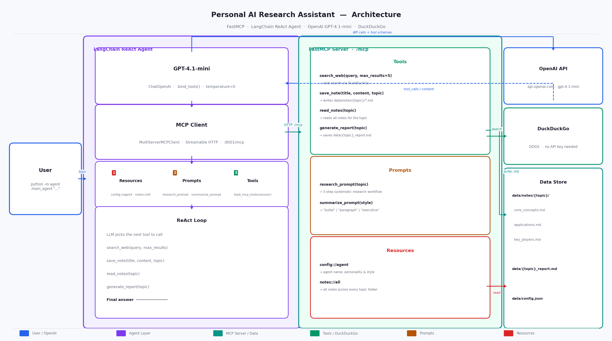

# Personal AI Research Assistant — MCP in Action

> Companion code for the Medium blog post  
> **"MCP in Action: Build a Personal AI Research Assistant"**

A production-quality demo that wires all **three MCP primitives** — Tools, Prompts, and Resources — to a LangChain ReAct agent powered by OpenAI GPT-4.1-mini.

---

## Architecture



The system is split into two independent processes that communicate over **Streamable HTTP**:

| Layer | Responsibility |
|---|---|
| **FastMCP Server** | Exposes tools, prompts, and resources over `/mcp` |
| **LangChain Agent** | Connects to the server, loads primitives, runs the ReAct loop |
| **OpenAI GPT-4.1-mini** | Decides which tool to call next; generates the final report |
| **DuckDuckGo DDGS** | Free web search — no API key required |

---

## MCP Primitives

### Tools — agent actions

| Tool | Signature | Description |
|---|---|---|
| `search_web` | `(query, max_results=5)` | DuckDuckGo search, returns formatted results with sources |
| `save_note` | `(title, content, topic)` | Writes `data/notes/{topic}/{slug}.md` with timestamp |
| `read_notes` | `(topic)` | Reads all notes for the current research topic |
| `generate_report` | `(topic)` | Combines all notes into `data/{topic}_report_{ts}.md` |

### Prompts — reusable templates

| Prompt | Arguments | Description |
|---|---|---|
| `research_prompt` | `topic: str` | 5-step systematic research workflow |
| `summarize_prompt` | `style: "bullet" \| "paragraph" \| "executive"` | Format-specific summarisation |

### Resources — read-only context

| URI | Description |
|---|---|
| `config://agent` | Agent name, personality, and research style from `data/config.json` |
| `notes://all` | All saved notes across every topic folder (injected before the agent starts) |

---

## Project Structure

```
research_assistant/
│
├── mcp_server/                     # FastMCP server — all MCP primitives
│   ├── server.py                   # Entry point — registers tools, prompts, resources
│   ├── tools/
│   │   ├── search.py               # search_web()
│   │   ├── notes.py                # save_note(), read_notes()
│   │   └── report.py               # generate_report()
│   ├── prompts/
│   │   ├── research.py             # research_prompt(topic)
│   │   └── summarize.py            # summarize_prompt(style)
│   └── resources/
│       ├── notes_resource.py       # notes://all
│       └── config_resource.py      # config://agent
│
├── agent/                          # LangChain agent — consumes the MCP server
│   ├── llm.py                      # Provider switcher: openai | openrouter | groq
│   ├── mcp_client.py               # MultiServerMCPClient (Streamable HTTP)
│   └── main_agent.py               # Full agent flow entry point
│
├── data/
│   ├── notes/                      # Research notes, organised by topic
│   │   └── {topic}/                # e.g. agentic_ai/, fine_tuning_llm/
│   └── config.json                 # Agent personality config
│
├── assets/
│   ├── architecture.png            # Architecture diagram
│   └── generate_diagram.py         # Diagram source (matplotlib)
│
├── tests/
│   ├── test_tools.py
│   ├── test_prompts.py
│   └── test_resources.py
│
├── .env                            # Your API keys (copy from .env.template)
├── .env.template                   # Safe template to commit
└── requirements.txt
```

---

## Quick Start

### 1. Install dependencies

```bash
pip install -r requirements.txt
```

### 2. Configure API keys

```bash
cp .env.template .env
# Open .env and fill in your OPENAI_API_KEY
```

`.env` supports three providers — switch by changing `LLM_PROVIDER`:

```env
# Default: OpenAI (recommended)
LLM_PROVIDER=openai
OPENAI_API_KEY=sk-proj-...

# Alternative: OpenRouter (free models)
# LLM_PROVIDER=openrouter
# OPENROUTER_API_KEY=sk-or-v1-...

# Alternative: Groq (free Llama)
# LLM_PROVIDER=groq
# GROQ_API_KEY=gsk_...
```

### 3. Start the MCP Server — Terminal 1

```bash
python -m mcp_server.server
```

```
Starting Research Assistant MCP Server...
Transport : Streamable HTTP
Address   : http://localhost:8001/mcp
```

### 4. Run the Agent — Terminal 2

```bash
python -m agent.main_agent "Agentic AI"
```

```
Research Assistant starting up...
Topic: Agentic AI

Reading config://agent resource...
Reading notes://all resource...
Fetching research_prompt template...
Loading MCP tools as LangChain tools...
   Loaded 4 tool(s): [search_web, save_note, read_notes, generate_report]

Starting research on: 'Agentic AI'
============================================================
[agent ReAct loop runs here — tool calls stream to stdout]

Research complete!
============================================================
[final report printed]
```

---

## Agent Flow

```
python -m agent.main_agent "Agentic AI"
         │
         ├── 1. Read  config://agent         (Resource — personality)
         ├── 2. Read  notes://all            (Resource — existing context)
         ├── 3. Fetch research_prompt(topic) (Prompt  — instructions)
         ├── 4. Load  MCP tools              (Tools   — 4 actions)
         │
         └── ReAct Loop (GPT-4.1-mini)
                  ├── search_web("Agentic AI core concepts")
                  ├── save_note("Core Concepts", "...", topic="Agentic AI")
                  ├── search_web("Agentic AI real-world applications")
                  ├── save_note("Applications", "...", topic="Agentic AI")
                  ├──  ... (up to 24 tool calls)
                  ├── generate_report(topic="Agentic AI")
                  └── Final answer returned
```

**Output files after a run:**

```
data/
├── notes/
│   └── agentic_ai/
│       ├── core_concepts.md
│       ├── recent_developments.md
│       ├── applications.md
│       └── key_players.md
└── agentic_ai_report_20260523_161200.md
```

---

## Configuration

Edit `data/config.json` to change the agent's personality:

```json
{
  "agent_name": "ResearchBot",
  "personality": "Focused, systematic research assistant. Always cite sources.",
  "research_style": "systematic",
  "summary_style": "bullet",
  "max_search_results": 5
}
```

---

## Running Tests

```bash
pytest tests/ -v
```

All tests run fully offline — DuckDuckGo is mocked, file I/O uses `tmp_path`.

---

## Tech Stack

| Component | Library / Service |
|---|---|
| MCP Server | [FastMCP](https://gofastmcp.com) |
| Agent Framework | [LangChain](https://python.langchain.com) + [LangGraph](https://langchain-ai.github.io/langgraph/) |
| MCP ↔ LangChain bridge | [langchain-mcp-adapters](https://github.com/langchain-ai/langchain-mcp-adapters) |
| Default LLM | OpenAI `gpt-4.1-mini` |
| Web Search | [ddgs](https://github.com/deedy5/ddgs) (DuckDuckGo, no API key) |
| Transport | Streamable HTTP (MCP spec) |

---

## References

1. [Model Context Protocol — Official Docs](https://modelcontextprotocol.io/introduction)
2. [FastMCP — Python MCP Framework](https://gofastmcp.com)
3. [LangChain MCP Adapters](https://github.com/langchain-ai/langchain-mcp-adapters)

---

## License

MIT — free to use, adapt, and share.
